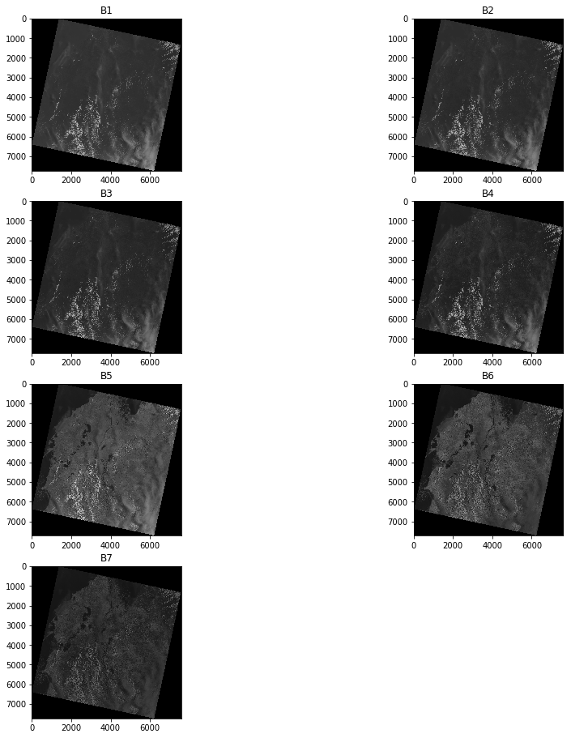
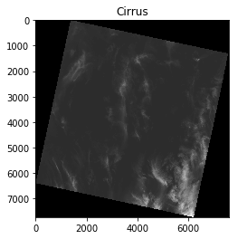
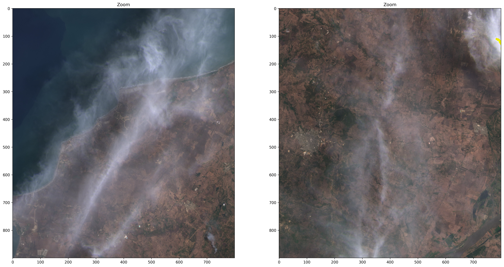
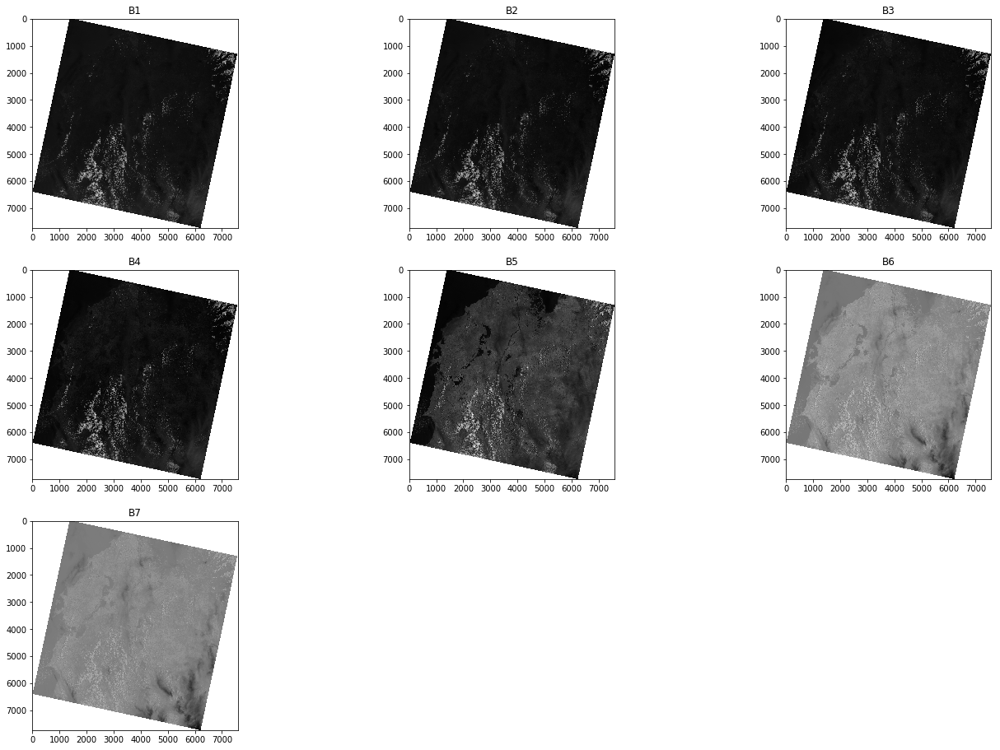
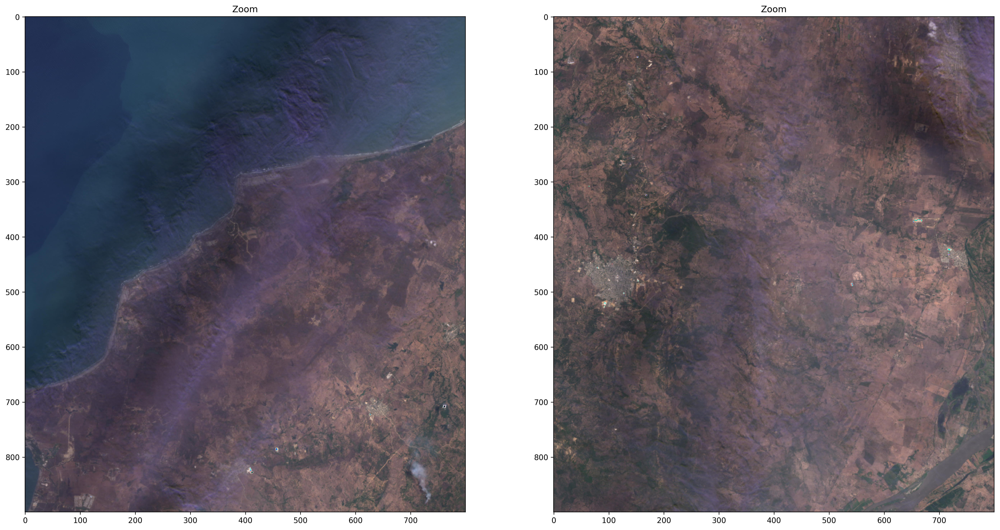

# Cirrus correction of Landsat 8 imagery

In this guide I will show you how to perform a cloud correction of your Landasat 8 multispectral imagery using the method proposed by [Meng Xu](https://ieeexplore.ieee.org/author/37085428151), [Xiuping Jia](https://ieeexplore.ieee.org/author/37085427273) and [Mark Pickering](https://ieeexplore.ieee.org/author/37062814100) published in the [2014 IEEE Geoscience and Remote Sensing Symposium](https://ieeexplore.ieee.org/xpl/conhome/6919813/proceeding):

**M. Xu, X. Jia and M. Pickering, "Automatic cloud removal for Landsat 8 OLI images using cirrus band," 2014 IEEE Geoscience and Remote Sensing Symposium, Quebec City, QC, 2014, pp. 2511-2514, doi: [10.1109/IGARSS.2014.6946983](https://ieeexplore.ieee.org/document/6946983).**


## Formal basis for correction


The effect of cirrus clouds on images can be modeled according to the equation:

<a href="https://www.codecogs.com/eqnedit.php?latex=y_i(u,v)&space;=&space;x_i^0(u,v)&space;&plus;&space;x_i^c(u,v)&space;\quad&space;i&space;=&space;1,2&space;\dots&space;7," target="_blank"></a>

where, $y_i(u,v)$ is the digital number (DN) stored by the OLI sensor for the band $i$ con *i=1,2 …7,* for the pixel located in $(u,v)$. $x_i^0(u,v)$ is the true DN related to land cover, and $x_i^c(u,v)$ is the contribution of the cirrus cloud to the DN based on its density. The correction seeks to recover $x_i^0(u,v)$.

The authors of the article suggest that $x_i^c(u,v)$ has a linear relationship with the ND $c(u,v)$ of the cirrus band.

<a href="https://www.codecogs.com/eqnedit.php?latex=x_i^c(u,v)&space;=&space;\alpha&space;*&space;[c\left(u,v\right)&space;-&space;min&space;\left(c(u,v)\right)]" target="_blank"></a>


With what finally the correction of each band is made by:

<a href="https://www.codecogs.com/eqnedit.php?latex=x_i^0(u,v)&space;=&space;y_i(u,v)&space;-&space;\alpha&space;*&space;[c\left(u,v\right)&space;-&space;min&space;\left(c(u,v)\right)]" target="_blank"></a>

De esta forma el  reto para poder conocer <a target="_blank"></a> es encontrar el factor de corrección <a target="_blank"></a> para cada una de las bandas.

## Methods to find <a target="_blank"></a>


The authors propose two methods to find the correction factor <a target="_blank"></a>: manual method and automatic method. The automatic correction method is implemented in this guide.

### Automatic correction method


This method consists of 3 stages: 

1. Window size definition.
2. linear regression between each band and the Cirrus band for each window. 
3. filtering of R ^ 2 greater than the user-defined threshold and determination of <a target="_blank"></a> from them.<a target="_blank"></a>  it is taken as the value of the slope of the regression with greater R^2.


The method does not require the creation of masks since the correction depends on the values ​​of the cirrus band. In the cirrus band, areas without the presence of cirrus clouds correspond to the lowest DN of the band, so <a target="_blank"></a>, that is to say, that in areas without the presence of cirrus clouds no correction is made.


```python
%matplotlib inline
import os
from matplotlib import pyplot as plt
from IPython.display import Image
import numpy as np
import cv2
import math
import time
from osgeo import gdal
from skimage import img_as_ubyte
import scipy
import pandas as pd
from sklearn.linear_model import LinearRegression
import statistics
```

The first step is to load image bands:


```python
images_dir =x = [os.path.join(r,file) for r,d,f in os.walk("Bands/") for file in f]
print("Image bands in directory: ", len(images_dir), '\n')
main_path = images_dir[0][:-6]
print(main_path)
band_ids =['B1', 'B2', 'B3', 'B4', 'B5', 'B6', 'B7', 'B9']

band_stack = []
pancr = []
cirrus =[]

band_list = []
for band in band_ids:
    if band != 'B8' and band != 'B9':
        full_path = main_path + band + '.TIF'
        print(full_path)
        ds = gdal.Open(full_path)
        band_stack.append(ds.GetRasterBand(1).ReadAsArray())
    elif band == 'B9':
        full_path = main_path + band + '.TIF'
        ds = gdal.Open(full_path)
        cirrus.append(ds.GetRasterBand(1).ReadAsArray())
        srs = ds.GetProjectionRef()
        GeoTransform = ds.GetGeoTransform()
                            
        x_size = ds.RasterXSize
        y_size = ds.RasterYSize
        
        
print("Multispectral bands found: ", len(band_stack), '\n')
print("Cirrus found: ", len(cirrus), '\n')
print("Reference system: \n", srs, '\n')
print("Transform: \n", GeoTransform, '\n')
```

    Image bands in directory:  10 
    
    Bands/LC08_L1TP_009053_20200430_20200430_01_RT_
    Bands/LC08_L1TP_009053_20200430_20200430_01_RT_B1.TIF
    Bands/LC08_L1TP_009053_20200430_20200430_01_RT_B2.TIF
    Bands/LC08_L1TP_009053_20200430_20200430_01_RT_B3.TIF
    Bands/LC08_L1TP_009053_20200430_20200430_01_RT_B4.TIF
    Bands/LC08_L1TP_009053_20200430_20200430_01_RT_B5.TIF
    Bands/LC08_L1TP_009053_20200430_20200430_01_RT_B6.TIF
    Bands/LC08_L1TP_009053_20200430_20200430_01_RT_B7.TIF
    Multispectral bands found:  7 
    
    Cirrus found:  1 
    
    Reference system: 
     PROJCS["WGS 84 / UTM zone 18N",GEOGCS["WGS 84",DATUM["WGS_1984",SPHEROID["WGS 84",6378137,298.257223563,AUTHORITY["EPSG","7030"]],AUTHORITY["EPSG","6326"]],PRIMEM["Greenwich",0,AUTHORITY["EPSG","8901"]],UNIT["degree",0.0174532925199433,AUTHORITY["EPSG","9122"]],AUTHORITY["EPSG","4326"]],PROJECTION["Transverse_Mercator"],PARAMETER["latitude_of_origin",0],PARAMETER["central_meridian",-75],PARAMETER["scale_factor",0.9996],PARAMETER["false_easting",500000],PARAMETER["false_northing",0],UNIT["metre",1,AUTHORITY["EPSG","9001"]],AXIS["Easting",EAST],AXIS["Northing",NORTH],AUTHORITY["EPSG","32618"]] 
    
    Transform: 
     (409185.0, 30.0, 0.0, 1234515.0, 0.0, -30.0) 
    


```python
# Contrast stretch function for enhance the bands
# Only for visualization purposes
def enhance_band(band, min_in= 1000, max_in= 30000):
    min_setup = 0.0
    max_setup = 1.0
    enhanced = (band-min_in)*(((max_setup-min_setup)/(max_in-min_in))+min_setup)
    return enhanced
```

Now we can plot the bands:


```python
plt.figure(1)
plt.subplots_adjust(left=0.0, right=2.0, bottom=0.0, top=3.0)
subp_idx = 421
for band, band_name in zip(band_stack, band_ids[:7]):
    plt.subplot(subp_idx) ,plt.imshow(band, cmap='gray'),plt.title(band_name)
    subp_idx += 1
plt.show()
```





The Cirrus band from Landsat 8 is plotted below:


```python
plt.figure(2)
plt.imshow(cirrus[0], cmap='gray'),plt.title('Cirrus')
plt.show()
```





```python
def get_min_band(array):
    min_array = np.ndarray.min(array[np.nonzero(array)])
    
    return min_array

def get_max_band(array):
    max_array = np.ndarray.max(array[np.nonzero(array)])
    
    return max_array
```


```python
red_array = band_stack[3].astype(np.uint16)


print(red_array.min())
print(red_array.max())
print(get_min_band(red_array))
print(get_max_band(red_array))


green_array = band_stack[2].astype(np.uint16)
blue_array = band_stack[1].astype(np.uint16)

RED_CH = enhance_band(red_array, min_in= get_min_band(red_array), max_in= 20000)
GREEN_CH = enhance_band(green_array, min_in= get_min_band(green_array), max_in= 20000)
BLUE_CH = enhance_band(blue_array, min_in= get_min_band(blue_array), max_in= 20000)

rgb = np.stack([RED_CH,GREEN_CH,BLUE_CH], axis=2) #axis =2 so its shape is (M,N,3) otherwise doesn't work with plt. (M, N, 3): an image with RGB values (0-1 float or 0-255 int)

```

    0
    65535
    6177
    65535


```python
plt.figure(1, dpi=300)
plt.subplots_adjust(left=0.0, right=3.0, bottom=0.0, top=3.0)
plt.subplot(111) ,plt.imshow(rgb[900:4900,1200:5200]),plt.title("Original image")
plt.show()

plt.figure(2, dpi=300)
plt.subplots_adjust(left=0.0, right=3.0, bottom=0.0, top=3.0)
plt.subplot(121) ,plt.imshow(rgb[1500:2400,1200:2000]),plt.title("Zoom")
plt.subplot(122) ,plt.imshow(rgb[1500:2400,3200:4000]),plt.title("Zoom")
plt.show()
```





Now we will define a window:


```python
# Define the window size
windowsize_r = 100
windowsize_c = 100

print(cirrus[0].shape[0] - windowsize_r, cirrus[0].shape[1] - windowsize_c)
print((cirrus[0].shape[0] - windowsize_r)/windowsize_r, (cirrus[0].shape[1] - windowsize_c)/windowsize_c)

```

    7631 7481
    76.31 74.81


```python
def dehaze(Band,Cirrus):
    R_square =[]
    coeffs = []
    
    for r in range(0,Band.shape[0] - windowsize_r, windowsize_r):
        for c in range(0,Band.shape[1] - windowsize_c, windowsize_c):
            window1 = Band[r:r+windowsize_r,c:c+windowsize_c]
            window2 = Cirrus[r:r+windowsize_r,c:c+windowsize_c]
            X =window1.ravel()
            #print("X: ", X)
            Y = window2.ravel()
            #print("Y: ", Y)
            if min(X) >0 and min(Y) >0:
                model = LinearRegression().fit(X.reshape((-1, 1)), Y.reshape((-1, 1)))
                r_sq = model.score(X.reshape((-1, 1)), Y.reshape((-1, 1)))
                #print('coefficient of determination:', r_sq)
                #print('intercept:', model.intercept_)
                #print('slope:', model.coef_)
                if r_sq > 0.9:
                    R_square.append(r_sq)
                    coeffs.append(model.coef_)
                    
    out = np.concatenate(coeffs).ravel()
    coeff = max(out)
    min_cirrus = np.ndarray.min(Cirrus[np.nonzero(Cirrus)])
    
    # 0 to NaN
    Band_nan = Band.astype(np.float32)
    Cirrus_nan = Cirrus.astype(np.float32)
    
    Band_nan[Band_nan == 0] = np.nan
    Cirrus_nan[Cirrus_nan == 0] = np.nan
    
    Cor_Band = Band_nan - coeff * (Cirrus_nan - min_cirrus)
    return Cor_Band, coeff
```


```python
Adj_bands = []
for band, band_name in zip(band_stack,band_ids[:7]):
    Cor_Band, coeff = dehaze(band,cirrus[0])
    Adj_bands.append(Cor_Band)
    print("Correction coefficient for ", band_name, ' is: ', coeff, '\n')
    
    file_output = main_path + 'DH_' +band_name + '.tif'
    print('Guardando banda: ' + file_output + '\n')
                    
    driver = gdal.GetDriverByName('GTiff')
    arch = driver.Create(file_output,x_size,y_size,1,gdal.GDT_UInt16)
    #arch = driver.Create(file_output,x_size,y_size,1,gdal.GDT_Float32)
    arch.SetGeoTransform(GeoTransform)
    arch.SetProjection(srs)
    arch.GetRasterBand(1).WriteArray(Cor_Band.astype(np.uint16))
    #arch.GetRasterBand(1).WriteArray(self.BANDA_CORR.astype(np.float32))
    del(arch)
```

    Correction coefficient for  B1  is:  1.1283407180009088 
    
    Guardando banda: Bands/LC08_L1TP_009053_20200430_20200430_01_RT_DH_B1.tif
    
    Correction coefficient for  B2  is:  1.0367915807207655 
    
    Guardando banda: Bands/LC08_L1TP_009053_20200430_20200430_01_RT_DH_B2.tif
    
    Correction coefficient for  B3  is:  1.128564641830951 
    
    Guardando banda: Bands/LC08_L1TP_009053_20200430_20200430_01_RT_DH_B3.tif
    
    Correction coefficient for  B4  is:  1.0718697157548667 
    
    Guardando banda: Bands/LC08_L1TP_009053_20200430_20200430_01_RT_DH_B4.tif
    
    Correction coefficient for  B5  is:  1.3424342074419604 
    
    Guardando banda: Bands/LC08_L1TP_009053_20200430_20200430_01_RT_DH_B5.tif
    
    Correction coefficient for  B6  is:  2.618422350018301 
    
    Guardando banda: Bands/LC08_L1TP_009053_20200430_20200430_01_RT_DH_B6.tif
    
    Correction coefficient for  B7  is:  2.957719319315782 
    
    Guardando banda: Bands/LC08_L1TP_009053_20200430_20200430_01_RT_DH_B7.tif
    


```python
plt.figure(3)
plt.subplots_adjust(left=0.0, right=3.0, bottom=0.0, top=3.0)
subp_idx = 331
for band, band_name in zip(Adj_bands, band_ids[:7]):
    plt.subplot(subp_idx) ,plt.imshow(band, cmap='gray'),plt.title(band_name)
    subp_idx += 1
plt.show()
```





```python
red_array_corr = Adj_bands[3].astype(np.uint16)
green_array_corr = Adj_bands[2].astype(np.uint16)
blue_array_corr = Adj_bands[1].astype(np.uint16)

RED_CH_CORR = enhance_band(red_array_corr, min_in= get_min_band(red_array_corr), max_in= 17000)
GREEN_CH_CORR = enhance_band(green_array_corr, min_in= get_min_band(green_array_corr), max_in= 17000)
BLUE_CH_CORR = enhance_band(blue_array_corr, min_in= get_min_band(blue_array_corr), max_in= 17000)

rgb_corr = np.stack([RED_CH_CORR,GREEN_CH_CORR,BLUE_CH_CORR], axis=2) #axis =2 so its shape is (M,N,3) otherwise doesn't work with plt. (M, N, 3): an image with RGB values (0-1 float or 0-255 int)

```


```python
plt.figure(1, dpi=300)
plt.subplots_adjust(left=0.0, right=3.0, bottom=0.0, top=3.0)
plt.subplot(111) ,plt.imshow(rgb_corr[900:4900,1200:5200]),plt.title("Corrected image")
plt.show()

plt.figure(2, dpi=300)
plt.subplots_adjust(left=0.0, right=3.0, bottom=0.0, top=3.0)
plt.subplot(121) ,plt.imshow(rgb_corr[1500:2400,1200:2000]),plt.title("Zoom")
plt.subplot(122) ,plt.imshow(rgb_corr[1500:2400,3200:4000]),plt.title("Zoom")
plt.show()
```





