<p style="font-size:300%; color:#04B45F; text-align:center;line-height : 80px; margin : 0; padding : 0;">
Mapping potato late blight from UAV-based multispectral imagery</p>

<p style="font-size:250%; color:#006EEA; text-align:center;line-height : 80px; margin : 0; padding : 0;">
Part 1</p>

Jorge Luis Rodríguez

email: jorodriguezga@unal.edu.co

# Guide 1 of 2 

## Introduction

This work proposes a method to process high resolution multispectral images for detection and mapping late blight in potato crops.
It is based on three main aspects: (i) morphological operations for background removing;
(ii) model trainig and supervised classification stage using a random forest classifier; and (iii) use of trained models in the classification of a different dataset.

# Data and methods

The study area is a 1920 sq.m. potato field located in Subachoque, Colombia (see figure). This field is part of an experimental plot designed to evaluate the potato *Diacol capiro* variety response to different nutrient treatments. As the weather conditions favoured the appearance of late blight disease in several plots, the project had the chance to monitor the crop disease development. The experimental plot was  inspected every seven days during the entire crop life span (i.e. 120 days from planting to maturity). 

The generated mosaic covered an area of 3.2 Ha, which include the experimental plot and a bigger area where a different variety of potato was located, being this variety
a yellow potato, this means, the tuber root colour it produces is yellow. In contrast, the potato from the experimental plot was from one variety of white potato (*Diacol capiro*).
The experimental plot area was clipped by using a reference polygon (red polygon).


## Study area:


    
High resolution multispectral images were acquired at 40 m altitude above the ground surface at 11:00 am local time (GMT-5). Each 
multispectral image acquired by the MicaSense camera had five bands as described in the next table.
In this work camera bands 4 and 5 have been reset according to the following order: Blue (B);
Green (G); Red (R); Red edge (RE) and Near infrared (NIR).

<table class="tg">
  <tr>
    <th class="tg-0pky"># Band</th>
    <th class="tg-0lax">Name</th>
    <th class="tg-0lax">Band center (nm)</th>
    <th class="tg-0lax">Bandwidth FWHM (nm)</th>
  </tr>
  <tr>
    <td class="tg-0lax">1</td>
    <td class="tg-0lax">Blue</td>
    <td class="tg-0lax">475</td>
    <td class="tg-0lax">20</td>
  </tr>
  <tr>
    <td class="tg-0lax">2</td>
    <td class="tg-0lax">Green</td>
    <td class="tg-0lax">560</td>
    <td class="tg-0lax">20</td>
  </tr>
  <tr>
    <td class="tg-0lax">3</td>
    <td class="tg-0lax">Red</td>
    <td class="tg-0lax">668</td>
    <td class="tg-0lax">10</td>
  </tr>
  <tr>
    <td class="tg-0lax">4</td>
    <td class="tg-0lax">Near infrared<br></td>
    <td class="tg-0lax">840</td>
    <td class="tg-0lax">40</td>
  </tr>
  <tr>
    <td class="tg-0lax">5</td>
    <td class="tg-0lax">Red edge</td>
    <td class="tg-0lax">717</td>
    <td class="tg-0lax">10</td>
  </tr>
</table>


Experimental crop area consisted of an array of 18 blocks of 12 m $\times$ 8 m inside of a field of 77 m $\times$ 24 m. Each block had 9 rows arranged along the long side
of the field with an area of 216 sq.m., the space between rows was 1m. Each row contained approximately 30 seed tubers of the same variety. 


(a) May 12, 2018

(b) May 26, 2018

The layout of the experimental crop. The yellow lines indicate the division of the field into 18 experimental blocks. (a) May 12, 2018; (b) May 26, 2018.


## Background removing

### Multispectral image load


```python
%matplotlib inline
import time
import os, shutil
from matplotlib import pyplot as plt
from matplotlib import colors
from IPython.display import Image
import numpy as np
import cv2
import math
import time
from osgeo import gdal
from skimage import img_as_ubyte
import scipy
import pandas as pd
from skimage.filters import threshold_otsu
import skimage.io as io
  
from sklearn.ensemble import AdaBoostClassifier, RandomForestClassifier, GradientBoostingClassifier, ExtraTreesClassifier
from sklearn.externals import joblib
from sklearn.metrics import plot_roc_curve, classification_report, multilabel_confusion_matrix
from sklearn.model_selection import train_test_split

from sklearn.svm import SVC, LinearSVC
from sklearn.neighbors import KNeighborsClassifier
```


```python
ds = gdal.Open('Raster/Correccion_reflectancia/MR_CE_20180512_Subachoque.tif')
```


```python
# asignacion cada banda 
AZUL = ds.GetRasterBand(1).ReadAsArray()
VERDE = ds.GetRasterBand(2).ReadAsArray()
ROJO = ds.GetRasterBand(3).ReadAsArray()
REDEDGE = ds.GetRasterBand(4).ReadAsArray()
NIR = ds.GetRasterBand(5).ReadAsArray()

srs = ds.GetProjectionRef()
geo_transform = ds.GetGeoTransform()

plt.figure(1, dpi=300)
plt.subplots_adjust(left=0.0, right=3.0, bottom=0.0, top=3.0)
plt.subplot(321) ,plt.imshow(AZUL, cmap='gray'),plt.title('Blue band')
plt.subplot(322) ,plt.imshow(VERDE, cmap='gray'),plt.title('Green band')
plt.subplot(323) ,plt.imshow(ROJO, cmap='gray'),plt.title('Red band')
plt.subplot(324) ,plt.imshow(REDEDGE, cmap='gray'),plt.title('Red edge band')
plt.subplot(325) ,plt.imshow(NIR, cmap='gray'),plt.title('Infrared band')
plt.show()
```


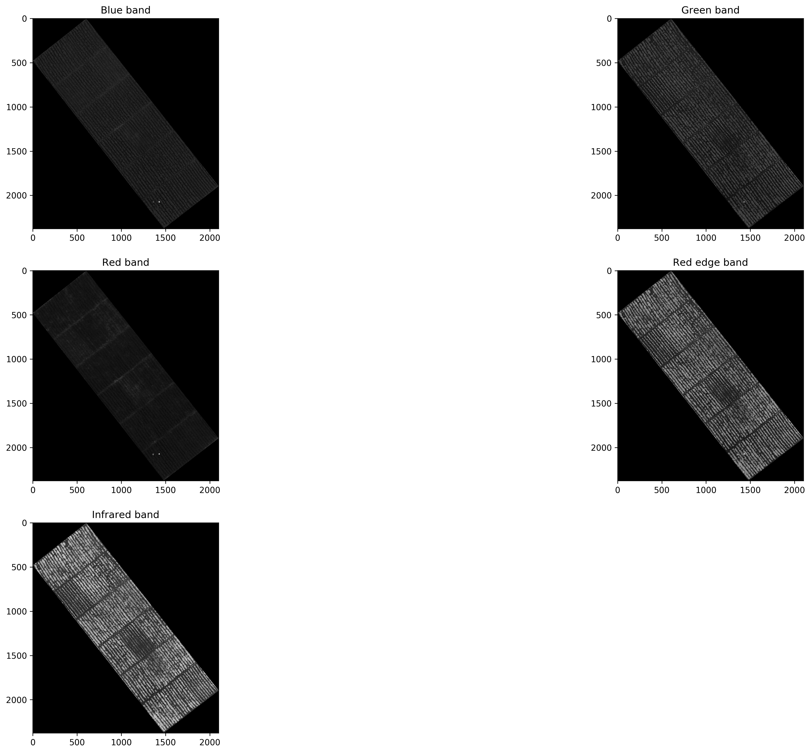


### Thresholding

A thresholding technique reduces a grey-level image into an image where objects and background are represented with two levels: a binary image (Glasbey, 1993). Because of the difference in reflectance between the soil and the potato plants, both near infrared and red edge bands allowed separation of the potato plants from the soil.

The first step was to analyse multispectral bands of the orthomosaics by plotting their histograms.
The next figure shows the histogram for each band in the multispectral
orthomosaic for the two categories under study as well as ground reference images of the two categories. Green, Rededge and Near infrared bands have right-skewed bimodal histograms in the first category. Bands with high weed presence had a right-skewed histograms without a clear valley. Thresholding method used to separate vegetation was OTSU's thresholding method (Otsu, 1979).


```python
hist_b1 = np.histogram(AZUL[AZUL!=0].ravel(),100,[0,1])[0]
hist_b2 = np.histogram(VERDE[VERDE!=0].ravel(),100,[0,1])[0]
hist_b3 = np.histogram(ROJO[ROJO!=0].ravel(),100,[0,1])[0]
hist_b4 = np.histogram(REDEDGE[REDEDGE!=0].ravel(),100,[0,1])[0]
hist_b5 = np.histogram(NIR[NIR!=0].ravel(),100,[0,1])[0]

hist_range = np.arange(0,1,0.01)
plt.figure(1, dpi=300)
plt.subplots_adjust(left=0.0, right=3.0, bottom=0.0, top=3.0)
plt.subplot(231), plt.bar(hist_range,hist_b1,0.01), plt.title("Blue")
plt.subplot(232), plt.bar(hist_range,hist_b2,0.01),plt.title('Green')
plt.subplot(233), plt.bar(hist_range,hist_b3,0.01),plt.title('Red')
plt.subplot(234), plt.bar(hist_range,hist_b4,0.01),plt.title('Rededge')
plt.subplot(235), plt.bar(hist_range,hist_b5,0.01),plt.title('Near infrared')
```


    (<matplotlib.axes._subplots.AxesSubplot at 0x7f99b2446390>,
     <Container object of 100 artists>,
     <matplotlib.text.Text at 0x7f99bdcb04a8>)


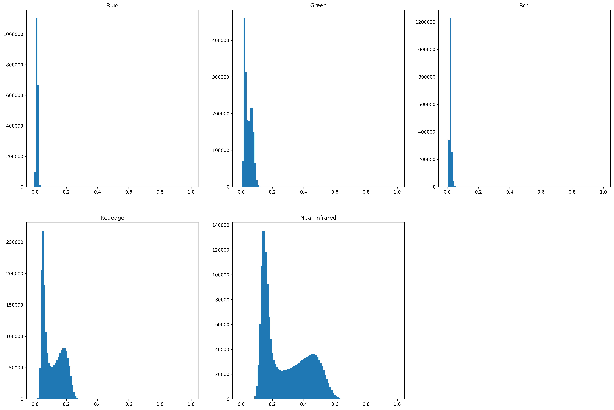


```python
image=NIR
hist_image = image.ravel()
hist = np.histogram(image[image!=0].ravel(),100,[0,1])[0]
thresh = threshold_otsu(image)
binary = image > thresh

plt.figure(1, dpi=300)
plt.subplots_adjust(left=0.0, right=3.0, bottom=0.0, top=3.0)
plt.subplot(131) ,plt.imshow(NIR, cmap='gray'),plt.title('Near infrared')
plt.subplot(132) ,plt.imshow(binary,cmap='gray'),plt.title('Binary image')
plt.show()

plt.show()
```


### Masking image

To delete background from original multispectral image we multiply each band for the binary image resulting from thresholding step using the next equation: 


<a href="https://www.codecogs.com/eqnedit.php?latex=\begin{equation}&space;\label{Eq3}&space;C_{i}(x,y)&space;=&space;A_{i}(x,y)B(x,y),&space;\end{equation}" target="_blank"></a>

where $C_{i}(x,y)$ is the resulting pixel at position $(x,y)$ for $i$ band without background, $A_{i}(x,y)$ is the original pixel at position $(x,y)$ for $i$ band
of the multispectral image and $B(x,y)$ is the binary image pixel at position $(x,y)$ created in the thresholding process.


```python
mask = np.array(binary, dtype='uint8')
filtered_mask = cv2.medianBlur(mask,3)

plt.figure(1, dpi=300)
plt.subplots_adjust(left=0.0, right=3.0, bottom=0.0, top=3.0)
plt.subplot(131) ,plt.imshow(NIR, cmap='gray'),plt.title('Banda NIR')
plt.subplot(132) ,plt.imshow(mask,cmap='gray'),plt.title('Mascara')
plt.subplot(133) ,plt.imshow(filtered_mask,cmap='gray'),plt.title('Mascara con filtro de mediana')
plt.show()

plt.show()
```


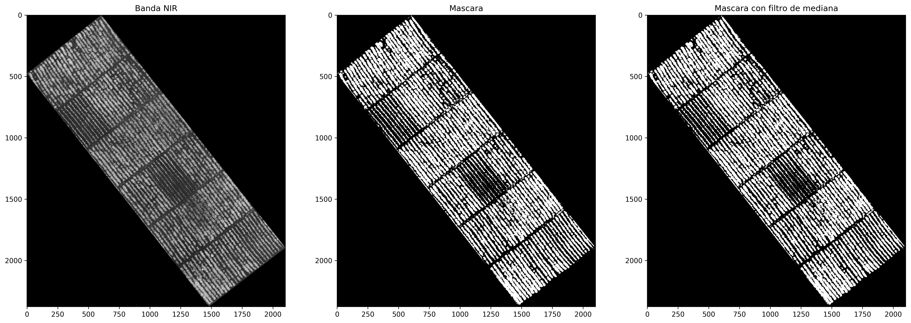


Here we can see how looks any band from the multispectral image after masking process. It can be seen how the ground surface does not appear any more.


```python
azul_seg = AZUL*filtered_mask
verde_seg = VERDE*filtered_mask
rojo_seg = ROJO*filtered_mask
rededge_seg = REDEDGE*filtered_mask
nir_seg = NIR*filtered_mask

plt.figure(1, dpi=300)
plt.subplots_adjust(left=0.0, right=3.0, bottom=0.0, top=3.0)
plt.subplot(321) ,plt.imshow(azul_seg, cmap='gray'),plt.title('Blue')
plt.subplot(322) ,plt.imshow(verde_seg, cmap='gray'),plt.title('Green')
plt.subplot(323) ,plt.imshow(rojo_seg, cmap='gray'),plt.title('Red')
plt.subplot(324) ,plt.imshow(rededge_seg, cmap='gray'),plt.title('Red edge')
plt.subplot(325) ,plt.imshow(nir_seg, cmap='gray'),plt.title('Near infrared')
plt.show()
```


We can now create a false colour composition to improve the visualization of the background removing step. This was performed for visualisation purposes only:


```python
# Contrast stretch function for enhance the bands
# Only for visualization purposes
def enhance_band(band, min_in= 0.1, max_in= 0.2):
    min_setup = 0.0
    max_setup = 1.0
    enhanced = (band-min_in)*(((max_setup-min_setup)/(max_in-min_in))+min_setup)
    return enhanced
```


```python
NIR_IN = enhance_band(NIR, min_in= 0.0, max_in= (NIR.max()-0.12))
ROJO_IN = enhance_band(ROJO, min_in= 0.0, max_in= (ROJO.max()-0.06))
VERDE_IN = enhance_band(VERDE, min_in= 0.0, max_in= VERDE.max())

rgb = np.stack([NIR_IN,ROJO_IN,VERDE_IN], axis=2) #axis =2 so its shape is (M,N,3) otherwise doesn't work with plt. (M, N, 3): an image with RGB values (0-1 float or 0-255 int)
mask = cv2.cvtColor(filtered_mask, cv2.COLOR_GRAY2BGR) # So we can apply the mask 
plantsImage = rgb*mask

plt.figure(1, dpi=300)
plt.subplots_adjust(left=0.0, right=3.0, bottom=0.0, top=3.0)
plt.subplot(121) ,plt.imshow(rgb),plt.title("Original image")
plt.subplot(122) ,plt.imshow(plantsImage),plt.title("Masked image")
plt.show()

plt.figure(2, dpi=300)
plt.subplots_adjust(left=0.0, right=3.0, bottom=0.0, top=3.0)
plt.subplot(121) ,plt.imshow(rgb[1450:1700,1100:1300]),plt.title("Original image")
plt.subplot(122) ,plt.imshow(plantsImage[1450:1700,1100:1300]),plt.title("Masked image")
plt.show()
```


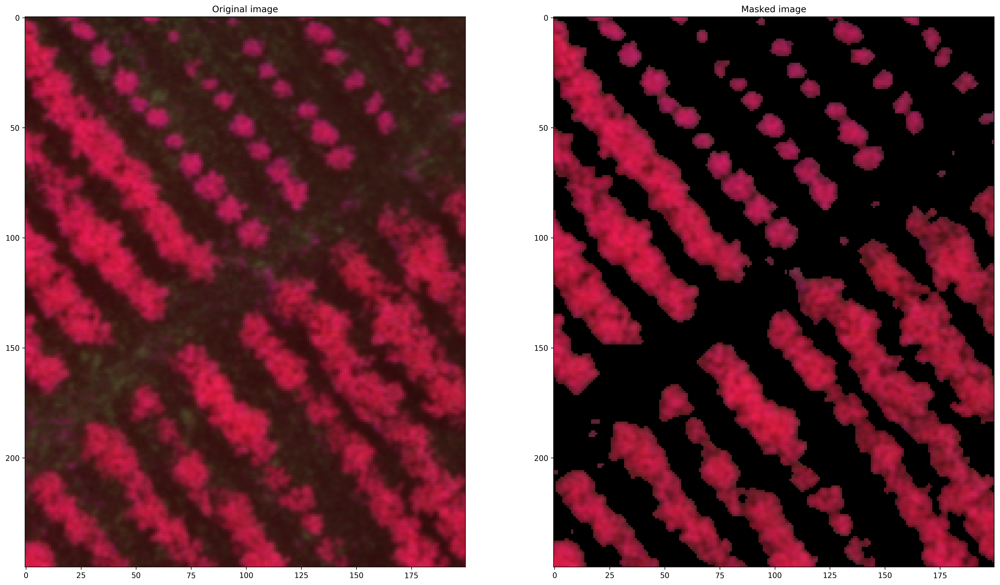


### Segmented bands to files

Now we proceed to save each of the segmented bands:


```python
bands_out = np.stack([azul_seg,
                      verde_seg,
                      rojo_seg,
                      rededge_seg,
                     nir_seg],
                     axis=2)

band_names = {'M_2018-05-12_Corte_Seg_B1.tif':0,
              'M_2018-05-12_Corte_Seg_B2.tif':1,
             'M_2018-05-12_Corte_Seg_B3.tif':2,
             'M_2018-05-12_Corte_Seg_B4.tif':3,
             'M_2018-05-12_Corte_Seg_B5.tif':4
             }
dir_out = 'Raster/Segmented/'

for band_name in band_names:
    filename_output = dir_out + band_name
    index = band_names[band_name]
    x_size = ds.RasterXSize  # Raster xsize
    y_size = ds.RasterYSize  # Raster ysize
    driver = gdal.GetDriverByName('GTiff')
    arch = driver.Create(filename_output,x_size,y_size,1,gdal.GDT_Float32)
    arch.SetGeoTransform(geo_transform)
    arch.SetProjection(srs)
    arch.GetRasterBand(1).WriteArray(bands_out[:,:,index].astype(np.float32))
    del(arch)
    print("Band "+band_name+" exported")
```

    Band M_2018-05-12_Corte_Seg_B5.tif exported
    Band M_2018-05-12_Corte_Seg_B4.tif exported
    Band M_2018-05-12_Corte_Seg_B1.tif exported
    Band M_2018-05-12_Corte_Seg_B3.tif exported
    Band M_2018-05-12_Corte_Seg_B2.tif exported


## Supervised classification of dataset (a) May 12, 2018, and models training

### Loading segmented bands


```python
rootdir = "Raster/Segmented"
# path to your training data
path_pix = "Entrenamiento/"
# path to your model
path_model = "Data/Models/"
# path to your classification results
path_class = "Data/Class/"

samples = path_pix + "Training_input.tif"

ds_seg1 = gdal.Open('Raster/Segmented/M_2018-05-12_Corte_Seg_B1.tif')
ds_seg2 = gdal.Open('Raster/Segmented/M_2018-05-12_Corte_Seg_B2.tif')
ds_seg3 = gdal.Open('Raster/Segmented/M_2018-05-12_Corte_Seg_B3.tif')
ds_seg4 = gdal.Open('Raster/Segmented/M_2018-05-12_Corte_Seg_B4.tif')
ds_seg5 = gdal.Open('Raster/Segmented/M_2018-05-12_Corte_Seg_B5.tif')

Segmented_image = np.stack([ds_seg1.GetRasterBand(1).ReadAsArray(),
                           ds_seg2.GetRasterBand(1).ReadAsArray(),
                           ds_seg3.GetRasterBand(1).ReadAsArray(),
                           ds_seg4.GetRasterBand(1).ReadAsArray(),
                           ds_seg5.GetRasterBand(1).ReadAsArray()], axis=2)
```

Training samples can be seen below:


```python
samples_ds = gdal.Open(samples)

samples_array = samples_ds.GetRasterBand(1).ReadAsArray()
samples_array_im = samples_array * filtered_mask
red_ch= enhance_band(ROJO, min_in= 0.0, max_in= (NIR.max()-0.12))
green_ch = enhance_band(VERDE, min_in= 0.0, max_in= (ROJO.max()-0.06))
blue_ch = enhance_band(AZUL, min_in= 0.0, max_in= VERDE.max())

rgb_natural_color = np.stack([red_ch,green_ch,blue_ch], axis=2)

cmap, norm = colors.from_levels_and_colors([0,0.9,1,2],['white','#EA0000','#001FFF'])

plt.figure(1, dpi=300)
plt.subplots_adjust(left=0.0, right=3.0, bottom=0.0, top=3.0)
plt.subplot(111) ,plt.imshow(rgb_natural_color),plt.imshow(samples_array, cmap=cmap, alpha=0.4),plt.title('Training samples')
plt.show()
```


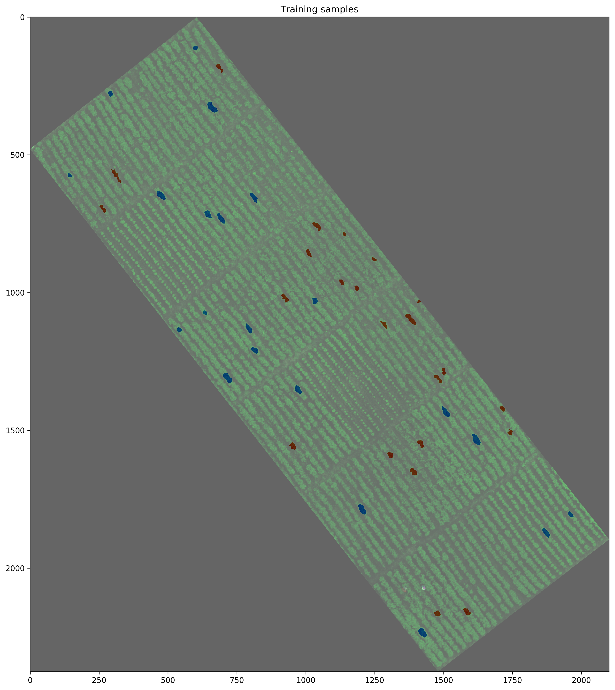


Training and classification of the dataset is performed by the next function:


```python
def plot_time(dt):
    fig, ax = plt.subplots()

    methods = ('RF', 'GBC', 'SVC', 'LSVC', 'KNN')
    y_pos = np.arange(len(methods))
    performance = dt

    ax.barh(y_pos, performance, align='center')
    ax.set_yticks(y_pos)
    ax.set_yticklabels(methods)
    ax.invert_yaxis()  # labels read top-to-bottom
    ax.set_xlabel('Seconds')
    ax.set_title('Performance by method')

    plt.show()

# declare a new function
def training(img_ds, samples, path_pix, path_model, path_class):

    img = img_ds.copy()

    # Load trainig classes 
    roi_ds = io.imread(samples)   
    roi = np.array(roi_ds, dtype='int8')  
    
    # read in your labels
    labels = np.unique(roi[roi > 0]) 
    print('The training data include {n} classes: {classes}'.format(n=labels.size, classes=labels))

    # compose your X,Y data (dataset - training data)     
    X = img[roi > 0, :] 
    Y = roi[roi > 0] 
    
    # Split dataset into trainig an test
    X_train, X_test, Y_train, Y_test = train_test_split(X, Y, random_state=42)

    # assign class weights (class 1 has the weight 3, etc.)
    #weights = {1:3, 2:2, 3:2, 4:2}
    weights = None
    #weights = "balanced_subsample"
    
    ################### Random Forest Classifier ##########################
    # build your Random Forest Classifier 
    # for more information: http://scikit-learn.org/stable/modules/generated/sklearn.ensemble.RandomForestClassifier.html
    ti_rf = time.time()
    rf = RandomForestClassifier(class_weight = weights, n_estimators = 500, criterion = 'gini', max_depth = 4, 
                                min_samples_split = 2, min_samples_leaf = 2, max_features = 'auto', 
                                bootstrap = True, oob_score = True, n_jobs = 2, random_state = None, verbose = True)  
    
    
    # now fit your training data with the original dataset
    rf = rf.fit(X_train,Y_train)

    # Save your Random Forest Model     
    model = path_model + "model_RF.pkl"
    joblib.dump(rf, model)   

    # call your random forest model
    rf = path_model + "model_RF.pkl"          
    clf = joblib.load(rf)    

    # Classification of array and save as image (23 refers to the number of multitemporal NDVI bands in the stack) 
    new_shape = (img.shape[0] * img.shape[1], img.shape[2]) 
    img_as_array = img[:, :, :23].reshape(new_shape)   

    class_prediction = clf.predict(img_as_array) 
    class_prediction = class_prediction.reshape(img[:, :, 0].shape)     
    tf_rf = time.time()
    dt_rf = tf_rf - ti_rf
    
    #########################Gradient Boost Classifier#############################
    # alternatively you may try out a Gradient Boosting Classifier 
    # It is much less RAM consuming and considers weak training data      
    ti_gbc = time.time()
    GBC = GradientBoostingClassifier(n_estimators = 500, min_samples_leaf = 1, min_samples_split = 4, max_depth = 4,    
                                    max_features = 'auto', learning_rate = 0.8, subsample = 1, random_state = None,         
                                    warm_start = True)
    
    # now fit your training data with the original dataset
    GBC = GBC.fit(X_train,Y_train)

    # Save your Gradient Boosting Model     
    model_GBC = path_model + "model_GBC.pkl"
    joblib.dump(GBC, model_GBC)

    GBC = path_model + "model_GBC.pkl"          
    clf_GBC = joblib.load(GBC)    

    # Classification of array and save as image (23 refers to the number of multitemporal NDVI bands in the stack) 
    new_shape = (img.shape[0] * img.shape[1], img.shape[2]) 
    img_as_array = img[:, :, :23].reshape(new_shape)   

    class_prediction_GBC = clf_GBC.predict(img_as_array) 
    class_prediction_GBC = class_prediction_GBC.reshape(img[:, :, 0].shape)
    tf_gbc = time.time()
    dt_gbc = tf_gbc - ti_gbc
        
    #########################Support Vector Classifier#############################    
    ti_svc = time.time()
    svc = SVC(random_state = None, gamma = 'auto')
    
    # now fit your training data with the original dataset
    svc = svc.fit(X_train,Y_train)

    # export your SVC model     
    model_svc = path_model + "model_svc.pkl"
    joblib.dump(svc, model_svc)

    # call your SVC model
    svc = path_model + "model_svc.pkl"          
    clf_svc = joblib.load(svc)    

    # Classification of array and save as image (23 refers to the number of multitemporal NDVI bands in the stack) 
    new_shape = (img.shape[0] * img.shape[1], img.shape[2]) 
    img_as_array = img[:, :, :23].reshape(new_shape)   

    class_prediction_svc = clf_svc.predict(img_as_array) 
    class_prediction_svc = class_prediction_svc.reshape(img[:, :, 0].shape)  
    tf_svc = time.time()
    dt_svc = tf_svc - ti_svc
    #########################Linear Support Vector Classifier#############################   
    ti_lsvc = time.time()
    lsvc = LinearSVC()
    
    # now fit your training data with the original dataset
    lsvc = lsvc.fit(X_train,Y_train)

    # export your Random Forest / Gradient Boosting Model     
    model_lsvc = path_model + "model_lsvc.pkl"
    joblib.dump(lsvc, model_lsvc)

    # call your Linear SVC model
    lsvc = path_model + "model_lsvc.pkl"          
    clf_lsvc = joblib.load(lsvc)    

    # Classification of array and save as image (23 refers to the number of multitemporal NDVI bands in the stack) 
    new_shape = (img.shape[0] * img.shape[1], img.shape[2]) 
    img_as_array = img[:, :, :23].reshape(new_shape)   

    class_prediction_lsvc = clf_lsvc.predict(img_as_array) 
    class_prediction_lsvc = class_prediction_lsvc.reshape(img[:, :, 0].shape)  

    tf_lsvc = time.time()
    dt_lsvc = tf_lsvc - ti_lsvc
    ######################### KNN Classifier#############################  
    ti_knn = time.time()
    knn = KNeighborsClassifier()
    
    # now fit your training data with the original dataset
    knn = knn.fit(X_train,Y_train)

    # export your KNN Model     
    model_knn = path_model + "model_knn.pkl"
    joblib.dump(knn, model_knn)

    # call your KNN model
    knn = path_model + "model_knn.pkl"          
    clf_knn = joblib.load(knn)    

    # Classification of array and save as image (23 refers to the number of multitemporal NDVI bands in the stack) 
    new_shape = (img.shape[0] * img.shape[1], img.shape[2]) 
    img_as_array = img[:, :, :23].reshape(new_shape)   

    class_prediction_knn = clf_knn.predict(img_as_array) 
    class_prediction_knn = class_prediction_knn.reshape(img[:, :, 0].shape) 
    
    tf_knn = time.time()
    dt_knn = tf_knn - ti_knn
    ########## Plot ROC curves ####################

    plt.rcParams['figure.dpi'] = 300
    ax = plt.gca()
    rfc_disp = plot_roc_curve(clf,X_test,Y_test, ax=ax)
    GBC_disp = plot_roc_curve(clf_GBC,X_test,Y_test, ax=rfc_disp.ax_)
    svc_disp = plot_roc_curve(clf_svc,X_test,Y_test, ax=GBC_disp.ax_, alpha=0.8)
    lsvc_disp = plot_roc_curve(clf_lsvc,X_test,Y_test, ax=svc_disp.ax_, alpha=0.8)
    knn_disp = plot_roc_curve(clf_knn,X_test,Y_test, ax=lsvc_disp.ax_, alpha=0.8)
    knn_disp.figure_.suptitle("ROC curve comparison")
    plt.show()
    
    
    ax1 = plt.gca()
    ax1.set(xlim=[0,0.5], ylim=[0.5,1])

    rfc_disp = plot_roc_curve(clf,X_test,Y_test, ax=ax1)
    GBC_disp = plot_roc_curve(clf_GBC,X_test,Y_test, ax=rfc_disp.ax_)
    svc_disp = plot_roc_curve(clf_svc,X_test,Y_test, ax=GBC_disp.ax_, alpha=0.8)
    lsvc_disp = plot_roc_curve(clf_lsvc,X_test,Y_test, ax=svc_disp.ax_, alpha=0.8)
    knn_disp = plot_roc_curve(clf_knn,X_test,Y_test, ax=lsvc_disp.ax_, alpha=0.8)
    knn_disp.figure_.suptitle("ROC curve comparison - ZOOM")
    plt.show()
    
    plot_time([dt_rf, dt_gbc, dt_svc, dt_lsvc,dt_knn])
    
    
    return class_prediction, class_prediction_GBC, class_prediction_svc, class_prediction_lsvc, class_prediction_knn
```


```python
class_prediction, class_prediction_GBC, class_prediction_svc, class_prediction_lsvc, class_prediction_knn = training(Segmented_image, samples, path_pix, path_model, path_class)

```

    The training data include 2 classes: [1 2]


    [Parallel(n_jobs=2)]: Using backend ThreadingBackend with 2 concurrent workers.
    [Parallel(n_jobs=2)]: Done  46 tasks      | elapsed:    0.2s
    [Parallel(n_jobs=2)]: Done 196 tasks      | elapsed:    0.7s
    [Parallel(n_jobs=2)]: Done 446 tasks      | elapsed:    1.7s
    [Parallel(n_jobs=2)]: Done 500 out of 500 | elapsed:    1.9s finished
    [Parallel(n_jobs=2)]: Using backend ThreadingBackend with 2 concurrent workers.
    [Parallel(n_jobs=2)]: Done  46 tasks      | elapsed:    4.0s
    [Parallel(n_jobs=2)]: Done 196 tasks      | elapsed:   16.9s
    [Parallel(n_jobs=2)]: Done 446 tasks      | elapsed:   38.1s
    [Parallel(n_jobs=2)]: Done 500 out of 500 | elapsed:   42.8s finished
    [Parallel(n_jobs=2)]: Using backend ThreadingBackend with 2 concurrent workers.
    [Parallel(n_jobs=2)]: Done  46 tasks      | elapsed:    0.0s
    [Parallel(n_jobs=2)]: Done 196 tasks      | elapsed:    0.0s
    [Parallel(n_jobs=2)]: Done 446 tasks      | elapsed:    0.1s
    [Parallel(n_jobs=2)]: Done 500 out of 500 | elapsed:    0.1s finished


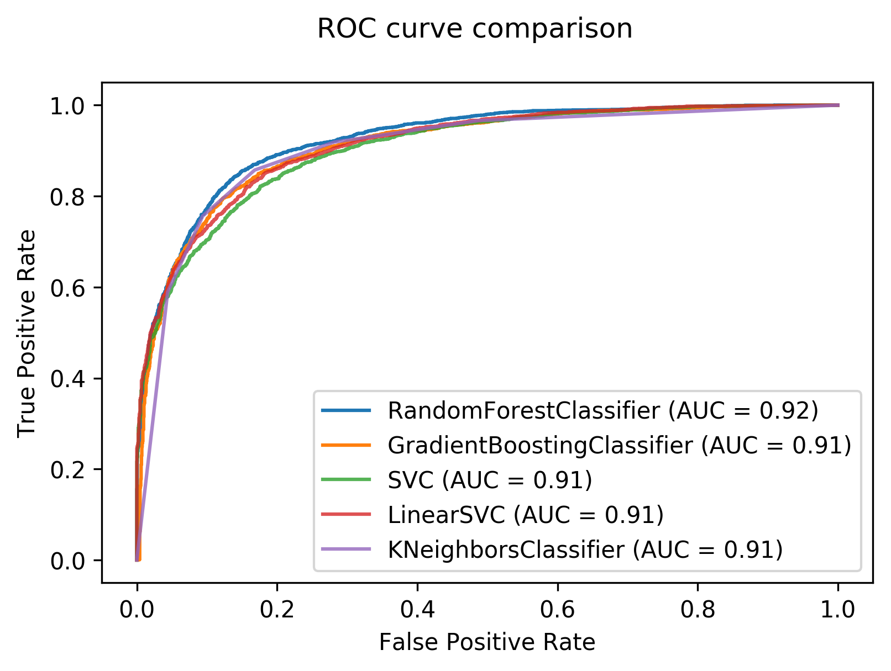


    [Parallel(n_jobs=2)]: Using backend ThreadingBackend with 2 concurrent workers.
    [Parallel(n_jobs=2)]: Done  46 tasks      | elapsed:    0.0s
    [Parallel(n_jobs=2)]: Done 196 tasks      | elapsed:    0.0s
    [Parallel(n_jobs=2)]: Done 446 tasks      | elapsed:    0.1s
    [Parallel(n_jobs=2)]: Done 500 out of 500 | elapsed:    0.1s finished


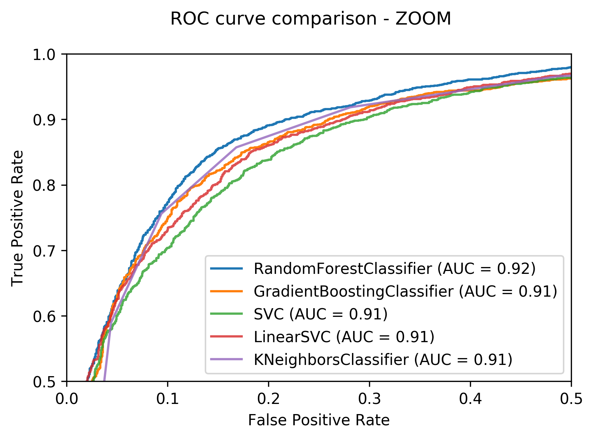


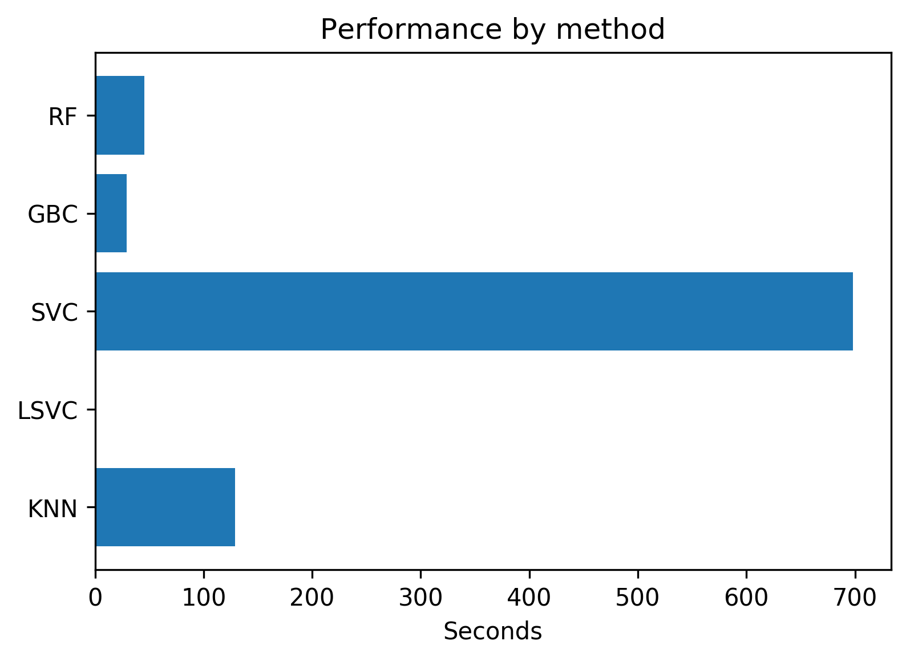


The scikit-klearn methods do not support NaN data, so we can't replace pixels with zero values by using np.nan, so when classifying, pixels with a zero value are included in one of the classes, in this case, in the late blight class. To clean the results, we use the mask created previously.


```python
from matplotlib.colors import from_levels_and_colors
cmap, norm = from_levels_and_colors([0,0.5,1,2],['black','red','yellow'])

plt.figure(3, dpi=300)
plt.subplots_adjust(left=0.0, right=3.0, bottom=0.0, top=3.0)
plt.subplot(231) ,plt.imshow(class_prediction, cmap=cmap),plt.title('RFC')
plt.subplot(232) ,plt.imshow(class_prediction_GBC,cmap=cmap),plt.title('GBC')
plt.subplot(233) ,plt.imshow(class_prediction_svc,cmap=cmap),plt.title('SVC')
plt.subplot(234) ,plt.imshow(class_prediction_lsvc,cmap=cmap),plt.title('LSVC')
plt.subplot(235) ,plt.imshow(class_prediction_knn,cmap=cmap),plt.title('KNN')
plt.show()
```


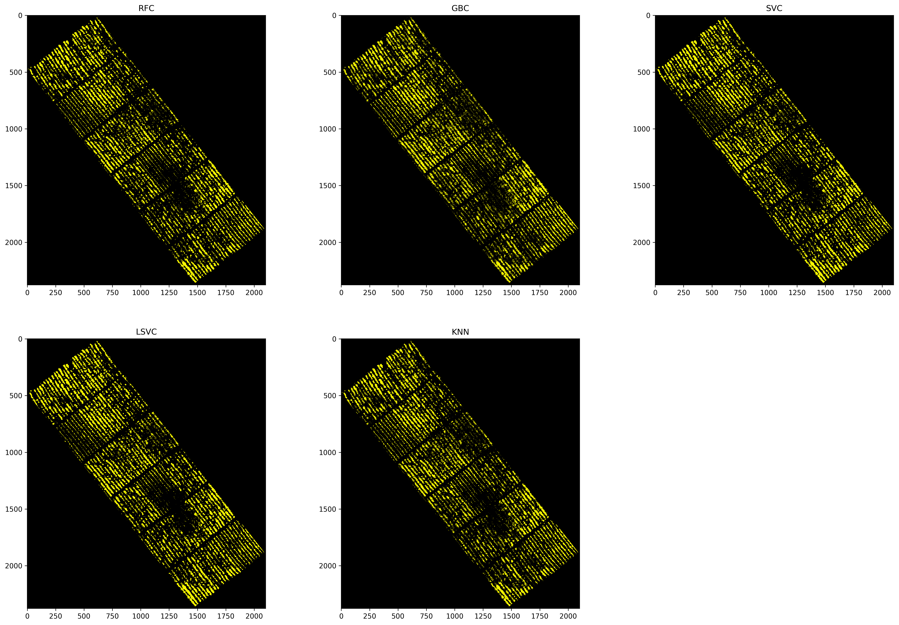


```python
cmap, norm = from_levels_and_colors([0,0.5,1,2],['white','#EA8A00','green'])

rf_classification = class_prediction*filtered_mask
gbc_classification = class_prediction_GBC*filtered_mask
svc_classification = class_prediction_svc*filtered_mask
lsvc_classification = class_prediction_lsvc*filtered_mask
knn_classification = class_prediction_knn*filtered_mask

plt.figure(1, dpi=300)
plt.subplots_adjust(left=0.0, right=3.0, bottom=0.0, top=3.0)
plt.subplot(231) ,plt.imshow(rf_classification, cmap=cmap),plt.title('RFC')
plt.subplot(232) ,plt.imshow(gbc_classification,cmap=cmap),plt.title('GBC')
plt.subplot(233) ,plt.imshow(svc_classification,cmap=cmap),plt.title('SVC')
plt.subplot(234) ,plt.imshow(lsvc_classification,cmap=cmap),plt.title('LSVC')
plt.subplot(235) ,plt.imshow(knn_classification,cmap=cmap),plt.title('KNN')
plt.show()

plt.figure(1, dpi=300)
plt.subplots_adjust(left=0.0, right=3.0, bottom=0.0, top=3.0)
plt.subplot(231) ,plt.imshow(rf_classification[1400:1700,1200:1400], cmap=cmap),plt.title('RFC Zoom')
plt.subplot(232) ,plt.imshow(gbc_classification[1400:1700,1200:1400],cmap=cmap),plt.title('GBC  Zoom')
plt.subplot(233) ,plt.imshow(svc_classification[1400:1700,1200:1400],cmap=cmap),plt.title('SVC  Zoom')
plt.subplot(234) ,plt.imshow(lsvc_classification[1400:1700,1200:1400],cmap=cmap),plt.title('LSVC  Zoom')
plt.subplot(235) ,plt.imshow(knn_classification[1400:1700,1200:1400],cmap=cmap),plt.title('KNN  Zoom')
plt.show()
```


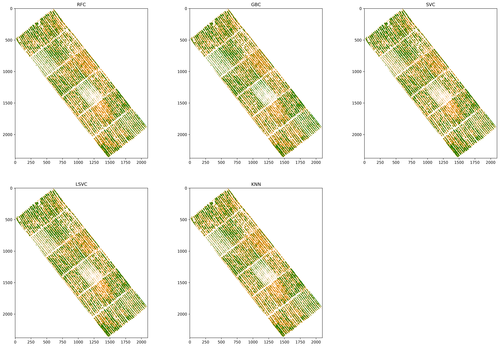


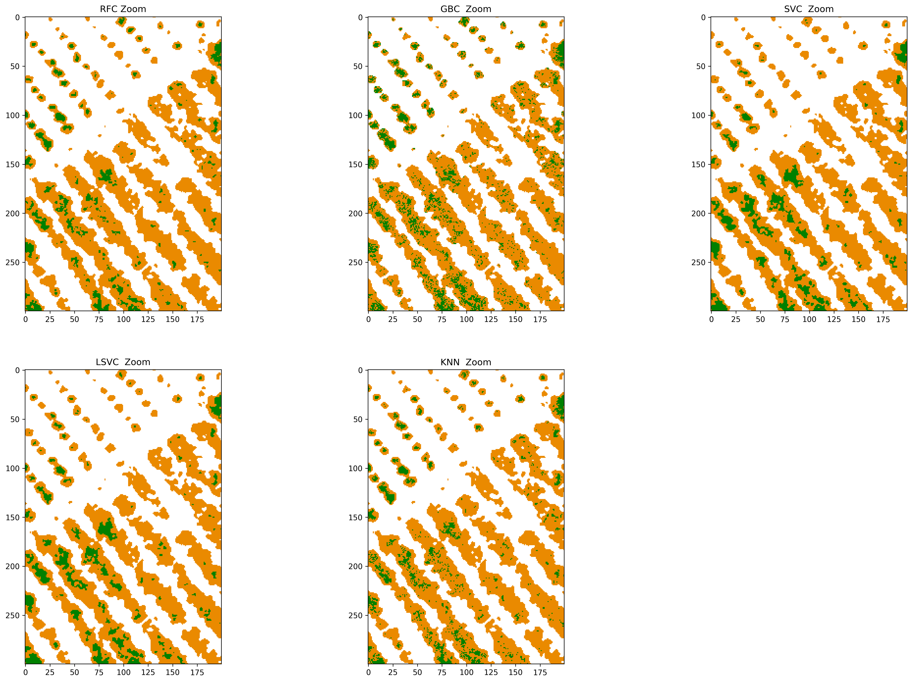


```python
labels_class = np.unique(class_prediction[class_prediction > 0]) 
print('The classified data include {n} classes: {classes}'.format(n=labels_class.size, classes=labels_class))
```

    The classified data include 2 classes: [1 2]


```python
class_out = np.stack([rf_classification,
                      gbc_classification,
                      svc_classification,
                      lsvc_classification,
                     knn_classification],
                     axis=2)

class_names = {'Class_2018-05-12_RF.tif':0,
              'Class_2018-05-12_GBC.tif':1,
             'Class_2018-05-12_SVC.tif':2,
             'Class_2018-05-12_LSVC.tif':3,
             'Class_2018-05-12_KNN.tif':4
             }
dir_out = 'Resultados/Jupyter/'

for class_name in class_names:
    filename_output = dir_out + class_name
    index = class_names[class_name]
    x_size = ds.RasterXSize  # Raster xsize
    y_size = ds.RasterYSize  # Raster ysize
    driver = gdal.GetDriverByName('GTiff')
    arch = driver.Create(filename_output,x_size,y_size,1,gdal.GDT_Float32)
    arch.SetGeoTransform(geo_transform)
    arch.SetProjection(srs)
    arch.GetRasterBand(1).WriteArray(class_out[:,:,index].astype(np.float32))
    del(arch)
    print("Classification "+class_name+" exported")
```

    Classification Class_2018-05-12_KNN.tif exported
    Classification Class_2018-05-12_LSVC.tif exported
    Classification Class_2018-05-12_SVC.tif exported
    Classification Class_2018-05-12_RF.tif exported
    Classification Class_2018-05-12_GBC.tif exported


# Accuracy assessment of results

## Loading ground reference


```python
ds_ground_truth = gdal.Open('Validacion/Raster/Ground_truth_2018-05-12-ML.tif')

# asignacion cada banda 
ground_truth_array_raw = ds_ground_truth.GetRasterBand(1).ReadAsArray()
ground_truth_array = ground_truth_array_raw*filtered_mask
srs = ds_ground_truth.GetProjectionRef()
geo_transform = ds_ground_truth.GetGeoTransform()

cmap, norm = from_levels_and_colors([0,0.5,1,2],['white','#EA8A00','green'])

plt.figure(1, dpi=300)
plt.subplots_adjust(left=0.0, right=3.0, bottom=0.0, top=3.0)
plt.subplot(111) ,plt.imshow(ground_truth_array, cmap=cmap),plt.title('Ground truth')
plt.show()

plt.figure(1, dpi=300)
plt.subplots_adjust(left=0.0, right=3.0, bottom=0.0, top=3.0)
plt.subplot(111) ,plt.imshow(ground_truth_array[1400:1700,1200:1400], cmap=cmap),plt.title('Ground truth Zoom')
plt.show()
```


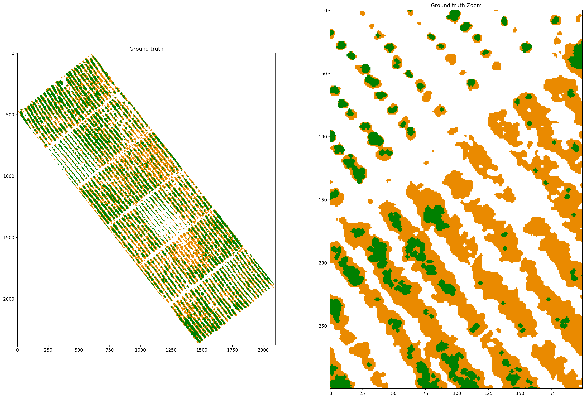


### Ground truth details


```python
def disease_info(array, geo_transform):
    unique, counts = np.unique(array[array!=0], return_counts=True)
    pix_width = geo_transform[1]
    pix_area = pix_width*pix_width

    lb_total_area = counts[0]*pix_area
    h_total_area = counts[1]*pix_area

    print("Late blight afected area: ", round(lb_total_area,2), "square meters")
    print("Healthy potato area: ", round(h_total_area,2), "square meters")
    print("Late blight vs Healthy potato area ratio: ", round(lb_total_area/h_total_area,2))
    print("Late blight area vs total area: ", round(lb_total_area/(lb_total_area+h_total_area),2))
    print("Healthy potato area vs total area: ", round(h_total_area/(lb_total_area+h_total_area),2))
```


```python
disease_info(ground_truth_array, geo_transform)
```

    Late blight afected area:  504.87 square meters
    Healthy potato area:  527.16 square meters
    Late blight vs Healthy potato area ratio:  0.96
    Late blight area vs total area:  0.49
    Healthy potato area vs total area:  0.51


____

## Classification accuracy assessment

Because of the orientation of the experimental plot in relation to the north, and the segmentation of the orthomosaic to separate the plants of the background, we have a big area with zero values. The classification report from scikit-learn take those zeros into account, so *global accuracy*, *macro avg* and *weighted avg* in this report, in our case, may not represent accurately the metrics for the classification of late blight affected plants and healthy potato plants.


```python
y_true = ground_truth_array.ravel()
target_names = ['0', 'Late blight', 'Healthy']

y_pred_rf = rf_classification.ravel()


print(classification_report(y_true, y_pred_rf, target_names=target_names))
```

                  precision    recall  f1-score   support
    
               0       1.00      1.00      1.00   3984453
     Late blight       0.76      0.98      0.86    492883
         Healthy       0.98      0.71      0.82    514640
    
        accuracy                           0.97   4991976
       macro avg       0.91      0.90      0.89   4991976
    weighted avg       0.97      0.97      0.97   4991976
    


Since the scikit report takes zeros into account as a class, we must create a function that allows us to calculate thematic accuracy metrics from the confusion matrix.


```python
def corr_metrics(y_true, y_pred):
    cm = confusion_matrix(y_true,y_pred)
    lbc = cm[1]
    hp = cm[2]
    tp = float(lbc[1])
    fn = float(lbc[2])
    fp = float(hp[1])
    tn = float(hp[2])
    tot = tp+fp+fn+tn
    
    cm_c = pd.DataFrame(np.array([
        [tp, fp, tp+fp], 
        [fn, tn, fn+tn],
        [tp+fn, fp+tn, tp+fp+fn+tn]
        ]),
        columns=['Actual - Late blight plants', 'Actual - Healthy plants', 'Total'],
        index =['Predicted - Late blight plants','Predicted - Healthy plants', 'Total']) 
    ### ACC
    ACC = (tp + tn)/(tp + tn + fp + fn)
    ### MCC
    mcc_a = tp * tn - fp * fn
    mcc_b = math.sqrt((tp + fp) * (tp + fn) * (tn + fp) * (tn + fn))
    MCC = mcc_a / mcc_b
    ### Kappa ###
    ##Tp
    
    Pr_a_tp = (tp + tn)/tot
    Pr_A1_tp = (tp + fp)/tot
    Pr_B1_tp = (tp + fn)/tot
    PrA1B1_tp = Pr_A1_tp * Pr_B1_tp
    Pr_A2_tp = (fn + tn)/tot
    Pr_B2_tp = (fp + tn)/tot
    PrA2B2_tp = Pr_A2_tp * Pr_B2_tp
    Pr_e_tp = PrA1B1_tp + PrA2B2_tp
    
    kappa = (Pr_a_tp - Pr_e_tp)/(1 - Pr_e_tp)
    """
    kappa_tp = (2 * tp)/(tot + tp - tn)
 
    kappa_tn = (2 * tn)/(tot + tn - tp)
    """
    precision_tp = tp / (tp + fp)
    precision_tn = tn / (tn + fn)

    recall_tp = tp / (tp + fn)
    recall_tn = tn / (fp + tn)

    sup_tp = tp + fn
    sup_tn = fp + tn

    F_score_tp = 2*(tp)/(2*tp + fp + fn)
    F_score_tn = 2*(tn)/(2*tn + fp + fn)

    df_table = pd.DataFrame(np.array([
        [round(precision_tp,3), round(recall_tp,3), round(F_score_tp,3),sup_tp], 
        [round(precision_tn,3), round(recall_tn,3), round(F_score_tn,3),sup_tn]
        ]),
        columns=['Precision', 'Recall', 'F1 score', 'Support'],
        index =['Late blight plants','Healthy plants'])
    #print('Accuraccy: ',round(ACC,2), '\nMCC: ', round(MCC,2))
    return df_table, cm_c, ACC, MCC, kappa
```

___

### Random forest:


```python
rf_table, cm_rf, rf_acc, rf_mcc, rf_kappa= corr_metrics(y_true, y_pred_rf)
cm_rf
```


<div>
<style scoped>
    .dataframe tbody tr th:only-of-type {
        vertical-align: middle;
    }

    .dataframe tbody tr th {
        vertical-align: top;
    }

    .dataframe thead th {
        text-align: right;
    }
</style>
<table border="1" class="dataframe">
  <thead>
    <tr style="text-align: right;">
      <th></th>
      <th>Actual - Late blight plants</th>
      <th>Actual - Healthy plants</th>
      <th>Total</th>
    </tr>
  </thead>
  <tbody>
    <tr>
      <th>Predicted - Late blight plants</th>
      <td>484246.0</td>
      <td>150716.0</td>
      <td>634962.0</td>
    </tr>
    <tr>
      <th>Predicted - Healthy plants</th>
      <td>8637.0</td>
      <td>363924.0</td>
      <td>372561.0</td>
    </tr>
    <tr>
      <th>Total</th>
      <td>492883.0</td>
      <td>514640.0</td>
      <td>1007523.0</td>
    </tr>
  </tbody>
</table>
</div>


```python
rf_table
```


<div>
<style scoped>
    .dataframe tbody tr th:only-of-type {
        vertical-align: middle;
    }

    .dataframe tbody tr th {
        vertical-align: top;
    }

    .dataframe thead th {
        text-align: right;
    }
</style>
<table border="1" class="dataframe">
  <thead>
    <tr style="text-align: right;">
      <th></th>
      <th>Precision</th>
      <th>Recall</th>
      <th>F1 score</th>
      <th>Support</th>
    </tr>
  </thead>
  <tbody>
    <tr>
      <th>Late blight plants</th>
      <td>0.763</td>
      <td>0.982</td>
      <td>0.859</td>
      <td>492883.0</td>
    </tr>
    <tr>
      <th>Healthy plants</th>
      <td>0.977</td>
      <td>0.707</td>
      <td>0.820</td>
      <td>514640.0</td>
    </tr>
  </tbody>
</table>
</div>


```python
print('Accuraccy: ',round(rf_acc,3),
      '\nMCC: ', round(rf_mcc,3), 
      '\nKappa: ', round(rf_kappa,3))
```

    Accuraccy:  0.842 
    MCC:  0.714 
    Kappa:  0.685


#### Disease details of Random forest


```python
disease_info(rf_classification, geo_transform)
```

    Late blight afected area:  650.4 square meters
    Healthy potato area:  381.62 square meters
    Late blight vs Healthy potato area ratio:  1.7
    Late blight area vs total area:  0.63
    Healthy potato area vs total area:  0.37


___

### Gradient Boost Classifier


```python
y_pred_gbc = gbc_classification.ravel()
gbc_table, gbc_cm, gbc_acc, gbc_mcc, gbc_kappa = corr_metrics(y_true, y_pred_gbc)
gbc_cm
```


<div>
<style scoped>
    .dataframe tbody tr th:only-of-type {
        vertical-align: middle;
    }

    .dataframe tbody tr th {
        vertical-align: top;
    }

    .dataframe thead th {
        text-align: right;
    }
</style>
<table border="1" class="dataframe">
  <thead>
    <tr style="text-align: right;">
      <th></th>
      <th>Actual - Late blight plants</th>
      <th>Actual - Healthy plants</th>
      <th>Total</th>
    </tr>
  </thead>
  <tbody>
    <tr>
      <th>Predicted - Late blight plants</th>
      <td>441354.0</td>
      <td>173013.0</td>
      <td>614367.0</td>
    </tr>
    <tr>
      <th>Predicted - Healthy plants</th>
      <td>51529.0</td>
      <td>341627.0</td>
      <td>393156.0</td>
    </tr>
    <tr>
      <th>Total</th>
      <td>492883.0</td>
      <td>514640.0</td>
      <td>1007523.0</td>
    </tr>
  </tbody>
</table>
</div>


```python
gbc_table
```


<div>
<style scoped>
    .dataframe tbody tr th:only-of-type {
        vertical-align: middle;
    }

    .dataframe tbody tr th {
        vertical-align: top;
    }

    .dataframe thead th {
        text-align: right;
    }
</style>
<table border="1" class="dataframe">
  <thead>
    <tr style="text-align: right;">
      <th></th>
      <th>Precision</th>
      <th>Recall</th>
      <th>F1 score</th>
      <th>Support</th>
    </tr>
  </thead>
  <tbody>
    <tr>
      <th>Late blight plants</th>
      <td>0.718</td>
      <td>0.895</td>
      <td>0.797</td>
      <td>492883.0</td>
    </tr>
    <tr>
      <th>Healthy plants</th>
      <td>0.869</td>
      <td>0.664</td>
      <td>0.753</td>
      <td>514640.0</td>
    </tr>
  </tbody>
</table>
</div>


```python
print('Accuraccy: ',round(gbc_acc,3),
      '\nMCC: ', round(gbc_mcc,3), 
      '\nKappa: ', round(gbc_kappa,3))
```

    Accuraccy:  0.777 
    MCC:  0.573 
    Kappa:  0.556


#### Disease details Gradient Boost Classifier


```python
disease_info(gbc_classification, geo_transform)
```

    Late blight afected area:  629.31 square meters
    Healthy potato area:  402.72 square meters
    Late blight vs Healthy potato area ratio:  1.56
    Late blight area vs total area:  0.61
    Healthy potato area vs total area:  0.39


___

### Support Vector Classifier


```python
y_pred_svc = svc_classification.ravel()
svc_table, svc_cm, svc_acc, svc_mcc, svc_kappa  = corr_metrics(y_true, y_pred_svc)
svc_cm
```


<div>
<style scoped>
    .dataframe tbody tr th:only-of-type {
        vertical-align: middle;
    }

    .dataframe tbody tr th {
        vertical-align: top;
    }

    .dataframe thead th {
        text-align: right;
    }
</style>
<table border="1" class="dataframe">
  <thead>
    <tr style="text-align: right;">
      <th></th>
      <th>Actual - Late blight plants</th>
      <th>Actual - Healthy plants</th>
      <th>Total</th>
    </tr>
  </thead>
  <tbody>
    <tr>
      <th>Predicted - Late blight plants</th>
      <td>482402.0</td>
      <td>121112.0</td>
      <td>603514.0</td>
    </tr>
    <tr>
      <th>Predicted - Healthy plants</th>
      <td>10481.0</td>
      <td>393528.0</td>
      <td>404009.0</td>
    </tr>
    <tr>
      <th>Total</th>
      <td>492883.0</td>
      <td>514640.0</td>
      <td>1007523.0</td>
    </tr>
  </tbody>
</table>
</div>


```python
svc_table
```


<div>
<style scoped>
    .dataframe tbody tr th:only-of-type {
        vertical-align: middle;
    }

    .dataframe tbody tr th {
        vertical-align: top;
    }

    .dataframe thead th {
        text-align: right;
    }
</style>
<table border="1" class="dataframe">
  <thead>
    <tr style="text-align: right;">
      <th></th>
      <th>Precision</th>
      <th>Recall</th>
      <th>F1 score</th>
      <th>Support</th>
    </tr>
  </thead>
  <tbody>
    <tr>
      <th>Late blight plants</th>
      <td>0.799</td>
      <td>0.979</td>
      <td>0.880</td>
      <td>492883.0</td>
    </tr>
    <tr>
      <th>Healthy plants</th>
      <td>0.974</td>
      <td>0.765</td>
      <td>0.857</td>
      <td>514640.0</td>
    </tr>
  </tbody>
</table>
</div>


```python
print('Accuraccy: ',round(svc_acc,3),
      '\nMCC: ', round(svc_mcc,3), 
      '\nKappa: ', round(svc_kappa,3))
```

    Accuraccy:  0.869 
    MCC:  0.758 
    Kappa:  0.74


#### Disease details Support Vector Classifier


```python
disease_info(svc_classification, geo_transform)
```

    Late blight afected area:  618.19 square meters
    Healthy potato area:  413.83 square meters
    Late blight vs Healthy potato area ratio:  1.49
    Late blight area vs total area:  0.6
    Healthy potato area vs total area:  0.4


___

### Linear Support Vector Classifier


```python
y_pred_lsvc = lsvc_classification.ravel()
lsvc_table, lsvc_cm, lsvc_acc, lsvc_mcc, lsvc_kappa  = corr_metrics(y_true, y_pred_lsvc)
lsvc_cm
```


<div>
<style scoped>
    .dataframe tbody tr th:only-of-type {
        vertical-align: middle;
    }

    .dataframe tbody tr th {
        vertical-align: top;
    }

    .dataframe thead th {
        text-align: right;
    }
</style>
<table border="1" class="dataframe">
  <thead>
    <tr style="text-align: right;">
      <th></th>
      <th>Actual - Late blight plants</th>
      <th>Actual - Healthy plants</th>
      <th>Total</th>
    </tr>
  </thead>
  <tbody>
    <tr>
      <th>Predicted - Late blight plants</th>
      <td>483526.0</td>
      <td>117071.0</td>
      <td>600597.0</td>
    </tr>
    <tr>
      <th>Predicted - Healthy plants</th>
      <td>9357.0</td>
      <td>397569.0</td>
      <td>406926.0</td>
    </tr>
    <tr>
      <th>Total</th>
      <td>492883.0</td>
      <td>514640.0</td>
      <td>1007523.0</td>
    </tr>
  </tbody>
</table>
</div>


```python
lsvc_table
```


<div>
<style scoped>
    .dataframe tbody tr th:only-of-type {
        vertical-align: middle;
    }

    .dataframe tbody tr th {
        vertical-align: top;
    }

    .dataframe thead th {
        text-align: right;
    }
</style>
<table border="1" class="dataframe">
  <thead>
    <tr style="text-align: right;">
      <th></th>
      <th>Precision</th>
      <th>Recall</th>
      <th>F1 score</th>
      <th>Support</th>
    </tr>
  </thead>
  <tbody>
    <tr>
      <th>Late blight plants</th>
      <td>0.805</td>
      <td>0.981</td>
      <td>0.884</td>
      <td>492883.0</td>
    </tr>
    <tr>
      <th>Healthy plants</th>
      <td>0.977</td>
      <td>0.773</td>
      <td>0.863</td>
      <td>514640.0</td>
    </tr>
  </tbody>
</table>
</div>


```python
print('Accuraccy: ',round(lsvc_acc,3),
      '\nMCC: ', round(lsvc_mcc,3), 
      '\nKappa: ', round(lsvc_kappa,3))
```

    Accuraccy:  0.875 
    MCC:  0.768 
    Kappa:  0.75


#### Disease details Linear Support Vector Classifier


```python
disease_info(lsvc_classification, geo_transform)
```

    Late blight afected area:  615.2 square meters
    Healthy potato area:  416.82 square meters
    Late blight vs Healthy potato area ratio:  1.48
    Late blight area vs total area:  0.6
    Healthy potato area vs total area:  0.4


___

### K-Neighbors Classifier


```python
y_pred_knn = knn_classification.ravel()
knn_table, knn_cm, knn_acc, knn_mcc, knn_kappa = corr_metrics(y_true, y_pred_knn)
knn_cm
```


<div>
<style scoped>
    .dataframe tbody tr th:only-of-type {
        vertical-align: middle;
    }

    .dataframe tbody tr th {
        vertical-align: top;
    }

    .dataframe thead th {
        text-align: right;
    }
</style>
<table border="1" class="dataframe">
  <thead>
    <tr style="text-align: right;">
      <th></th>
      <th>Actual - Late blight plants</th>
      <th>Actual - Healthy plants</th>
      <th>Total</th>
    </tr>
  </thead>
  <tbody>
    <tr>
      <th>Predicted - Late blight plants</th>
      <td>471622.0</td>
      <td>173844.0</td>
      <td>645466.0</td>
    </tr>
    <tr>
      <th>Predicted - Healthy plants</th>
      <td>21261.0</td>
      <td>340796.0</td>
      <td>362057.0</td>
    </tr>
    <tr>
      <th>Total</th>
      <td>492883.0</td>
      <td>514640.0</td>
      <td>1007523.0</td>
    </tr>
  </tbody>
</table>
</div>


```python
knn_table
```


<div>
<style scoped>
    .dataframe tbody tr th:only-of-type {
        vertical-align: middle;
    }

    .dataframe tbody tr th {
        vertical-align: top;
    }

    .dataframe thead th {
        text-align: right;
    }
</style>
<table border="1" class="dataframe">
  <thead>
    <tr style="text-align: right;">
      <th></th>
      <th>Precision</th>
      <th>Recall</th>
      <th>F1 score</th>
      <th>Support</th>
    </tr>
  </thead>
  <tbody>
    <tr>
      <th>Late blight plants</th>
      <td>0.731</td>
      <td>0.957</td>
      <td>0.829</td>
      <td>492883.0</td>
    </tr>
    <tr>
      <th>Healthy plants</th>
      <td>0.941</td>
      <td>0.662</td>
      <td>0.777</td>
      <td>514640.0</td>
    </tr>
  </tbody>
</table>
</div>


```python
print('Accuraccy: ',round(knn_acc,3),
      '\nMCC: ', round(knn_mcc,3), 
      '\nKappa: ', round(knn_kappa,3))
```

    Accuraccy:  0.806 
    MCC:  0.645 
    Kappa:  0.615


#### Disease details K-Neighbors Classifier


```python
disease_info(knn_classification, geo_transform)
```

    Late blight afected area:  661.16 square meters
    Healthy potato area:  370.86 square meters
    Late blight vs Healthy potato area ratio:  1.78
    Late blight area vs total area:  0.64
    Healthy potato area vs total area:  0.36


___


# References

Glasbey, C.A., 1993.  An Analysis of Histogram-Based Thresholding Algorithms.

Otsu, N., 1979. A Threshold Selection Method from Gray-Level Histograms. IEEE transactions on systems, man, and cybernetics 9, 62–66.arXiv:1011.1669v3.

Scikit-learn: Machine Learning in Python, Pedregosa et al., JMLR 12, pp. 2825-2830, 2011
